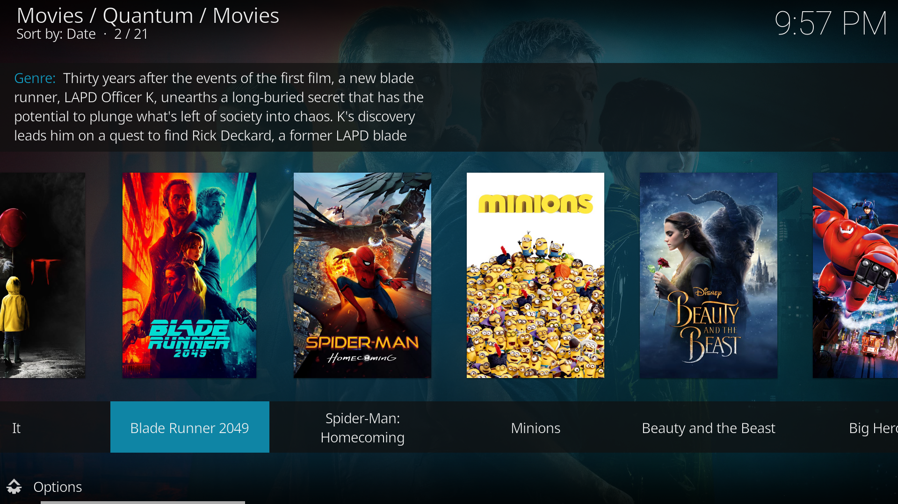
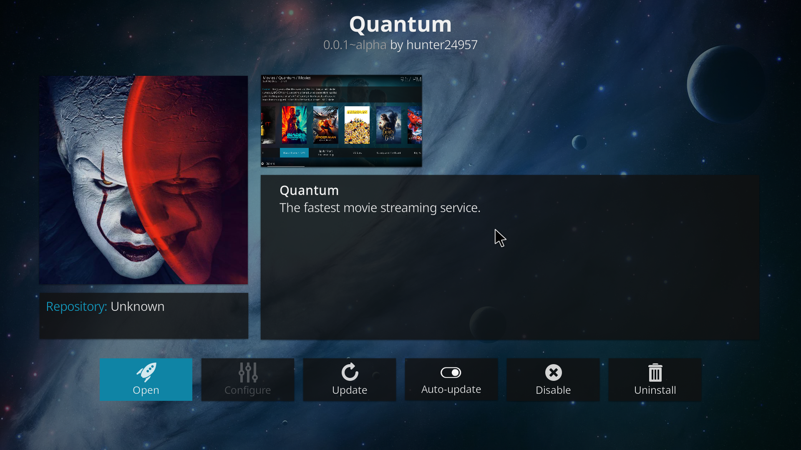

# Quantum
A completely revamped streaming addon for Kodi Krypton.

## Introduction
Most of the "free" movie streaming addons for Kodi nowadays are ripped off, half assed projects, that abstract their horrible code by using Kodi's nice UI. Unfortunatly due to this, they can be slower or more prone to errors. For example one of the most popular addons for Kodi today has around 10 scraping scripts that are incompleted or just do not work. I'm here to change that. Quantum will be a complete revamp of these crippled sources, wrtten completely from scratch in Python 2.7. It will provide more responsive stream sources, no unnecessary/broken code and a ton of high quality movies.

## Screenshots

